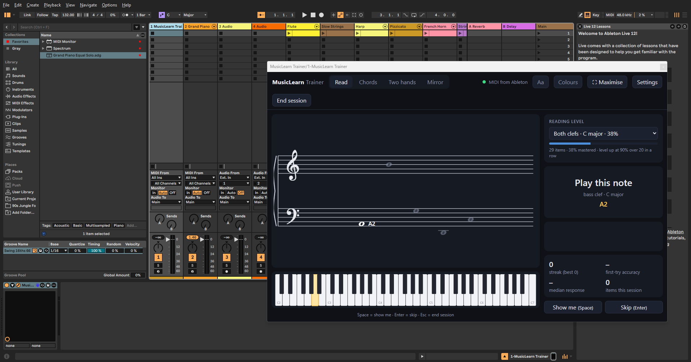

# MusicLearn Trainer

A VST3 plugin for Ableton Live (or any VST3 host on Windows) that turns your MIDI keyboard into a
music-reading and chord trainer. It sits on a MIDI track, watches what you play, shows it on a real
grand staff, and tells you — visually, never with sound — whether you played what was asked. MIDI
passes straight through, so recording, instruments, Spectrum and everything else in Live keep
working.



Built with [JUCE 8](https://juce.com) (WebView2 front end) and the
[Bravura](https://github.com/steinbergmedia/bravura) music font.

## Why

Most people who learn keyboard from "falling notes" videos never learn to read music or to
understand the chords they are playing, because the video always shows the answer. This plugin
hides the answer and makes you produce it, on the keyboard you already have, inside the DAW you
already use.

## Setting it up in Ableton Live

1. Install the plugin (see [Building](#building), or copy a release into
   `C:\Program Files\Common Files\VST3\`). In Live: **Options → Preferences → Plug-Ins**, make sure
   **Use VST3 System Folders** is on, then **Rescan**.
2. In the browser go to **Plug-Ins → VST3 → MusicLearn → MusicLearn Trainer** and drag it onto
   a new MIDI track. Name the track "Trainer".
3. On that track set **MIDI From** to your keyboard (or *All Ins*) and **Monitor** to **In**.
4. Click the wrench icon on the device to open the trainer window. Drag its corner to resize,
   or press **Maximise** in the header.
5. To hear yourself while you practise, use a second MIDI track with any instrument on it, with
   the same **MIDI From** and **Monitor In**. Both tracks receive the keyboard; the trainer sees
   every note, the instrument makes the sound, and you can arm and record the instrument track
   as usual.

   Alternative: set the instrument track's **MIDI From** to the *Trainer* track and choose
   *MusicLearn Trainer* in the second chooser — the plugin's MIDI output is the same notes.

Controllers with drum pads (Novation Launchkey, for example) usually send the pads on MIDI
channel 10; the trainer ignores that channel by default (Settings → *Ignore MIDI channel 10*).

Note names follow standard notation (middle C = **C4**). Live's piano roll calls the same key
**C3**; switch to Ableton naming in Settings if that is less confusing.

## Using it

Four tabs, each with levels that unlock as you master them:

- **Read** — a note is drawn on the staff; play it. Levels go treble → bass → both →
  accidentals → key signatures → ledger lines.
- **Chords** — a chord symbol (`Dm7`) or a roman numeral (`vi in G major`) is shown; play it in
  any inversion. Levels go triads → all roots → dim/aug → roman numerals → 7ths.
- **Two hands** — left hand plays the root below middle C, right hand plays the chord above it.
  Also measures how close together the two hands land (in milliseconds).
- **Mirror** — no test. Whatever you hold is drawn on the staff and named (chord, inversion,
  interval). Use it to explore.

Buttons/keys: **Space** shows the answer (counts as a hint), **Enter** skips, **Esc** ends the
session and shows a summary you can copy into a practice log.

Header toggles: **Aa** writes the note name next to every note on the staff; **Colours** gives
each letter its own colour (C red, D orange, E yellow, F green, G blue, A purple, B pink — sharps
and flats share their letter's colour) on the staff and on the piano. Both are training wheels:
turn them off once the positions are familiar. **Maximise** asks Windows to maximise the plugin
window (Live only offers a close button); it falls back to filling the screen if the host ignores
it.

Settings also has **Delay before the next item** (default 250 ms; 0 = instant) and **Preview
upcoming items** (default 4): in Read mode the coming notes are drawn further along the staff
like a line of music, in Chords / Two hands they appear as a "Next:" line.

## How it is designed to teach

- **Retrieval, not copying.** Falling-note videos show the answer; the trainer hides it and makes
  you produce it. New items are shown once with the answer (guided), then never again unless you
  ask or fail.
- **Immediate, specific feedback.** A wrong note is drawn in red on the staff exactly where it
  sits, next to the note that was asked, with a message such as "F5 — one step too high" or
  "the key signature makes every F sharp".
- **Misses come back within a few items** (short-loop re-testing), and the item selector
  weights everything by your error rate and how long since you last saw it — a light form of
  spaced repetition.
- **Interleaving.** Items are mixed within a level rather than drilled in blocks.
- **Mastery gates.** A level suggests moving on when the last 16–20 scored items are ≥90 %
  first-try with a quick median response. Nothing is forced; pick any level any time.
- **Two-hand coordination** is trained with the simplest possible left-hand job (one note) and a
  measurable target (hands landing within ~30 ms).
- **No sound cues.** Success is a soft green flash and a tick; errors a red flash. The
  instrument you route to is the only thing you hear.

Progress is stored in the plugin's WebView2 profile (`%LOCALAPPDATA%\MusicLearnTrainer\WebView2`),
so it persists across Live sessions and sets. Nothing leaves your machine.

## Building

Windows only for now (the UI is hosted in WebView2).

Requirements:

- Visual Studio 2022 or later with the **Desktop development with C++** workload.
- Python 3 with `pip install cmake ninja` (the build script picks CMake and Ninja up from the
  Python packages, so no separate installs are needed).
- A JUCE 8.0.8 checkout: `git clone --depth 1 --branch 8.0.8 https://github.com/juce-framework/JUCE.git`
- The [Microsoft.Web.WebView2](https://www.nuget.org/packages/Microsoft.Web.WebView2/1.0.1901.177)
  NuGet package (1.0.1901.177), extracted so that the `Microsoft.Web.WebView2.1.0.1901.177`
  folder sits inside a directory of your choosing.

By default `CMakeLists.txt` looks for JUCE at `%USERPROFILE%\Documents\git\JUCE` and the WebView2
package under `%USERPROFILE%\Documents\git\_deps\webview2`. Either put them there or pass
`-DJUCE_DIR=... -DJUCE_WEBVIEW2_PACKAGE_LOCATION=...` to CMake.

```
build.cmd          # configures with CMake + Ninja, builds VST3 and Standalone
install.cmd        # copies the VST3 into C:\Program Files\Common Files\VST3\ (asks for admin)
```

Build output goes to `%LOCALAPPDATA%\MusicLearnTrainer\build\MusicLearnTrainer_artefacts\Release\`
so the source tree stays clean. After installing, reload the plugin in Live (or
**Preferences → Plug-Ins → Rescan**). If Live has the old build loaded, `install.cmd` moves the
locked DLL aside and Live picks up the new one the next time the plugin is loaded.

The Standalone build is handy for testing without a host. Close Live before running it: Windows
lets only one program hold a MIDI port.

### Working on the UI

The whole UI is a single file, `ui/index.html`, embedded into the plugin at build time. To work on
it without rebuilding, serve the `ui` folder and open it in Chrome:

```
cd ui
python -m http.server 8765
# then open http://127.0.0.1:8765/index.html
```

In a browser the page uses Web MIDI (close Live first) or the computer keyboard (A–K = C4–C5,
W E T Y U = black keys, Z/X = octave), and has a built-in practice sound. Rebuild to embed changes.

Levels and item pools are plain data (`LEVELS`, `itemsFor`) in the HTML; add new drills there.

## Layout

```
CMakeLists.txt        JUCE plugin definition (VST3 + Standalone)
build.cmd             one-shot MSVC + CMake + Ninja build
install.cmd/.ps1      elevated copy into the system VST3 folder
Source/               thin C++ shell: MIDI FIFO + WebView2 host
ui/index.html         all UI and learning logic
ui/Bravura.woff2      music notation font (SIL OFL)
```

## Roadmap

- Rhythm: notated rhythms with a metronome, timing feedback against the beat.
- Ear training: identify intervals/chords played by the host.
- Progress chart across sessions.
- macOS build (WebKit back end).

## Licence

MusicLearn Trainer is released under the [GNU AGPL v3](LICENSE), which is what the AGPLv3 option
of the JUCE licence requires. The Bravura font is © Steinberg Media Technologies GmbH and
licensed under the SIL Open Font License 1.1 (`ui/LICENSE-Bravura.txt`).
